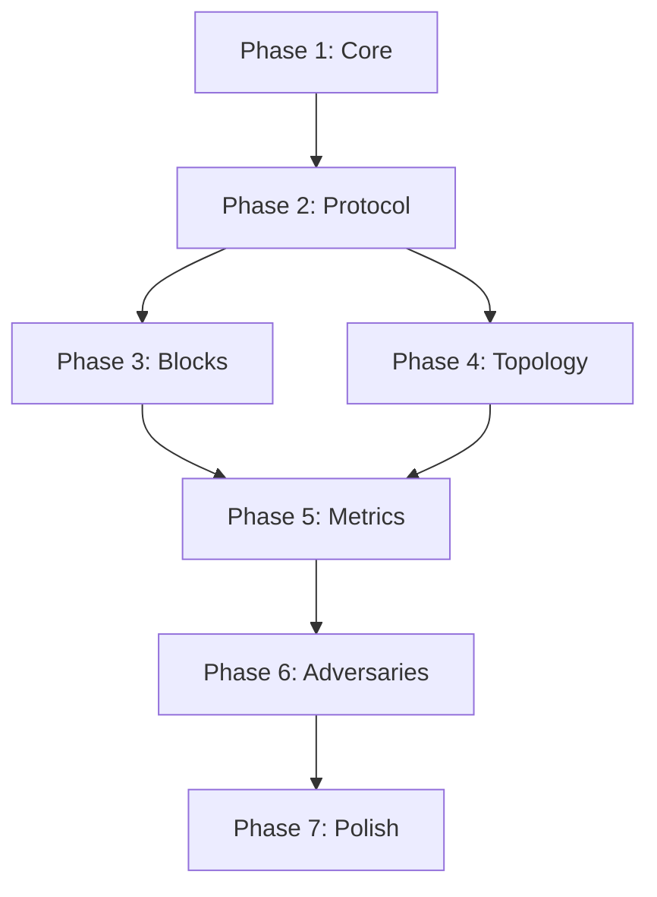

# Sparse blobpool simulator implementation plan

This document outlines the phased implementation approach for building the EIP-8070 sparse blobpool discrete event simulator as specified in [simulator-specification.md](simulator-specification.md).

---

## Phase 1: Core infrastructure

> **Goal**: Minimal working event loop with actor scaffolding.

### 1.1 Project setup

- [x] Initialize with `uv init`
- [x] Configure `pyproject.toml`:
  - Python 3.13+
  - Dependencies: `pydantic`, `numpy`, `networkx`
  - Dev dependencies: `pytest`, `ruff`
- [x] Create directory structure per spec section 11

#### Files

| File               | Contents                                                           |
| ------------------ | ------------------------------------------------------------------ |
| `core/__init__.py` | Exports                                                            |
| `core/types.py`    | `ActorId`, `TxHash`, `Address`, `RequestId`, `Region` type aliases |
| `config.py`        | `SimulationConfig` dataclass with defaults                         |

---

### 1.2 Event loop & actor base

- [x] Implement `Event` dataclass with ordering
- [x] Implement `Simulator` with `heapq`-based event queue
- [x] Implement `Actor` ABC with `on_event()` entrypoint
- [x] Implement `schedule()` and timer scheduling

#### Files

| File                | Contents                                                |
| ------------------- | ------------------------------------------------------- |
| `core/simulator.py` | `Simulator`, `Event`, `EventPayload`                    |
| `core/actor.py`     | `Actor` ABC, `TimerPayload`, `TimerKind`, `SendRequest` |

#### Verification

```bash
uv run pytest tests/test_core/test_simulator.py -v
```

- Event ordering by (timestamp, priority)
- Timer scheduling advances time correctly
- Actor dispatch matches payload type

---

### 1.3 Network actor

- [x] Implement `Network` actor extending `Actor`
- [x] Implement latency matrix with region pairs
- [x] Implement basic delay calculation (no CoDel yet)
- [x] Wire `SendRequest` → delayed `Message` delivery

#### Files

| File              | Contents                                       |
| ----------------- | ---------------------------------------------- |
| `core/network.py` | `Network`, `LatencyParams`, `LATENCY_DEFAULTS` |

#### Verification

- Messages between same-region actors have lower latency
- Cross-region latency matches spec values
- Jitter is bounded within expected range

---

## Phase 2: Protocol layer

> **Goal**: Node actor with blobpool and eth/71 message handling.

### 2.1 Message types

- [x] Implement `Message` base with `size_bytes`
- [x] Implement all eth/71 messages:
  - `NewPooledTransactionHashes`
  - `GetPooledTransactions` / `PooledTransactions`
  - `GetCells` / `Cells`
- [x] Implement `BlockAnnouncement`

#### Files

| File                    | Contents                                  |
| ----------------------- | ----------------------------------------- |
| `protocol/messages.py`  | All message dataclasses                   |
| `protocol/constants.py` | `CELL_SIZE`, `CELLS_PER_BLOB`, `ALL_ONES` |

---

### 2.2 Blobpool state

- [x] Implement `Blobpool` with tx tracking
- [x] Implement `BlobTxEntry` with all fields
- [x] Implement `by_sender` index for nonce tracking
- [x] Implement RBF logic (`try_replace`, fee bump validation)
- [x] Implement size-based eviction

#### Files

| File                   | Contents                                      |
| ---------------------- | --------------------------------------------- |
| `protocol/blobpool.py` | `Blobpool`, `BlobTxEntry`, `Role`, `TxStatus` |

#### Verification

- RBF requires 10% fee bump
- Size limit enforced
- 16 tx per sender limit enforced

---

### 2.3 Node actor

- [x] Implement `Node` extending `Actor`
- [x] Implement `on_event()` dispatcher
- [x] Implement role determination (hash-based, p=0.15)
- [x] Implement provider flow: fetch full blob
- [x] Implement sampler flow: wait for providers, fetch custody cells
- [x] Implement request timeout handling
- [x] Implement reannouncement after successful fetch

#### Files

| File               | Contents                               |
| ------------------ | -------------------------------------- |
| `protocol/node.py` | `Node`, `NodeConfig`, `PendingRequest` |

#### Verification

- Role distribution ~15% provider over many txs
- Samplers wait for 2 provider signals
- Timeout triggers fallback behavior

---

## Phase 3: Block production

> **Goal**: Transactions exit blobpool via block inclusion.

### 3.1 BlockProducer actor

- [x] Implement `BlockProducer` extending `Actor`
- [x] Implement slot tick scheduling (12s interval)
- [x] Implement proposer rotation
- [x] Implement blob selection with inclusion policies
- [x] Implement `BlockAnnouncement` broadcast

#### Files

| File                     | Contents                                                |
| ------------------------ | ------------------------------------------------------- |
| `core/block_producer.py` | `BlockProducer`, `InclusionPolicy`, `Block`, `SlotTick` |

---

### 3.2 Node block handling

- [x] Handle `BlockAnnouncement` in Node
- [x] Mark included txs as `INCLUDED`
- [x] Schedule cleanup timers
- [x] Remove txs after cleanup delay

#### Verification

- Included txs removed from blobpool
- Metrics record inclusion slot

---

## Phase 4: Topology & initialization

> **Goal**: Realistic network topology and simulation bootstrap.

### 4.1 Topology generation

- [x] Implement `RandomGraph` strategy
- [x] Implement `GeographicKademlia` strategy
- [x] Assign regions based on config distribution

#### Files

| File              | Contents                                     |
| ----------------- | -------------------------------------------- |
| `p2p/topology.py` | `build_topology()`, strategy implementations |

---

### 4.2 Simulation runner

- [x] Implement `build_simulation()` factory
- [x] Register all actors (Network, Nodes, BlockProducer)
- [x] Establish peer connections per topology
- [x] Inject initial transactions

#### Files

| File                    | Contents                |
| ----------------------- | ----------------------- |
| `scenarios/baseline.py` | Honest network scenario |

#### Verification

```bash
uv run python -m scenarios.baseline
```

- 2000 nodes initialized
- Peer connections match mesh degree D=50
- Transactions propagate to >99% of network

---

## Phase 5: Metrics & analysis

> **Goal**: Collect and report simulation outcomes.

### 5.1 MetricsCollector

- [x] Implement bandwidth tracking (per-node, per-link)
- [x] Implement propagation tracking (first-seen, 99%-seen)
- [x] Implement timeseries snapshots
- [x] Implement `finalize()` → `SimulationResults`

#### Files

| File                   | Contents                                                        |
| ---------------------- | --------------------------------------------------------------- |
| `metrics/collector.py` | `MetricsCollector`                                              |
| `metrics/results.py`   | `SimulationResults`, `BandwidthSnapshot`, `PropagationSnapshot` |

---

### 5.2 Reporting

- [x] Compute derived metrics (bandwidth reduction, provider ratio)
- [x] Export results to JSON
- [ ] Optional: matplotlib visualization

#### Verification

- [x] Bandwidth reduction: 1.36x (full propagation baseline; 4x requires cell-based transfer)
- [x] Provider ratio ≈ 0.15 (observed: 0.150)

---

## Phase 6: Adversaries

> **Goal**: Implement attack scenarios from threat model.

### 6.1 Adversary base

- [x] Implement `Adversary` ABC
- [x] Support controlled node injection

#### Files

| File                  | Contents                    |
| --------------------- | --------------------------- |
| `adversaries/base.py` | `Adversary`, `AttackConfig` |

---

### 6.2 T1.1/T1.2 Spam attack

- [x] Implement `SpamAdversary`
- [x] Configure spam rate, validity
- [x] Measure spam amplification

#### Files

| File                       | Contents                            |
| -------------------------- | ----------------------------------- |
| `adversaries/spam.py`      | `SpamAdversary`, `SpamAttackConfig` |
| `scenarios/spam_attack.py` | Scenario runner                     |

---

### 6.3 T2.1 Selective withholding

- [x] Implement `WithholdingAdversary`
- [x] Serve only allowed columns
- [x] Measure detection rate via C_extra

#### Files

| File                         | Contents                                    |
| ---------------------------- | ------------------------------------------- |
| `adversaries/withholding.py` | `WithholdingAdversary`, `WithholdingConfig` |

---

### 6.4 T4.2 Targeted poisoning

- [x] Implement `TargetedPoisoningAdversary`
- [x] Signal availability only to victim
- [x] Create nonce gap chains
- [x] Measure victim blobpool pollution

#### Files

| File                       | Contents                                                |
| -------------------------- | ------------------------------------------------------- |
| `adversaries/poisoning.py` | `TargetedPoisoningAdversary`, `TargetedPoisoningConfig` |
| `scenarios/poisoning.py`   | Scenario runner                                         |

---

## Phase 7: Polish & validation

> **Goal**: Production-ready simulator.

### 7.1 CoDel queue modeling

- [x] Implement CoDel delay calculation
- [x] Track per-link queue state

---

### 7.2 Comprehensive test suite

- [x] Unit tests for all modules
- [x] Integration tests for scenarios
- [x] Property-based tests for role distribution

---

### 7.3 Documentation

- [x] README with usage examples
- [ ] API documentation (optional)
- [ ] Results interpretation guide (optional)

---

## Dependency graph



---

## Estimated effort

| Phase          | Effort | Cumulative |
| -------------- | ------ | ---------- |
| 1. Core        | 2-3h   | 2-3h       |
| 2. Protocol    | 4-5h   | 6-8h       |
| 3. Blocks      | 1-2h   | 7-10h      |
| 4. Topology    | 2-3h   | 9-13h      |
| 5. Metrics     | 2-3h   | 11-16h     |
| 6. Adversaries | 3-4h   | 14-20h     |
| 7. Polish      | 2-3h   | 16-23h     |

**Total**: ~16-23 hours of focused implementation.
