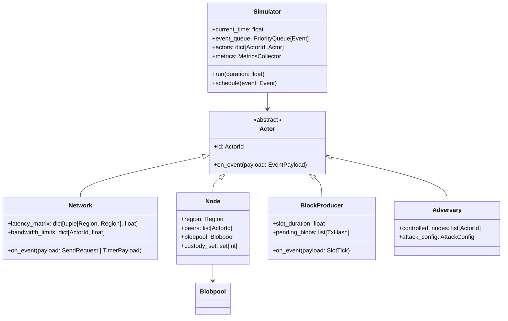

# Sparse blobpool simulator specification

This document specifies the design and implementation details for a lightweight, custom discrete event simulator (DES) for the [EIP-8070](eip-8070.md) sparse blobpool.

## Goals

- Simulate the propagation and availability of blobs in the Ethereum P2P network under the sparse blobpool protocol.
- Evaluate bandwidth reduction claims (target ~4x reduction).
- Verify resilience against specific threat models (spam, data withholding, eclipse-lite attacks).
- Model network latency and congestion reasonably accurately without full packet-level fidelity.

## Architecture

The simulator uses an actor model driven by a global discrete event loop. **Everything is an Actor**—stateful entities with a single entrypoint (`on_event`) that the Simulator invokes. Actors communicate via messages; the **Network** actor models transport delays.

### Invocation chain

```
┌─────────────┐     schedule(Event)      ┌─────────────┐
│  Simulator  │ ◄──────────────────────► │ Event Queue │
└──────┬──────┘                          └─────────────┘
       │ pop event
       │ call actor.on_event(payload)
       ▼
┌─────────────┐
│    Actor    │  (Network, Node, BlockProducer, Adversary)
└──────┬──────┘
       │ actor.send(msg, to) → Network.on_event(SendRequest)
       ▼
┌─────────────┐
│   Network   │  calculates delay, schedules Event(target=recipient)
└─────────────┘
```

**Key invariant**: Actors never call each other directly. All communication flows through `Network.send()` which schedules delayed delivery events.

### Core components



---

## 1. Simulation engine (DES core)

### Class: `Simulator`

Single-threaded, deterministic execution using a min-heap priority queue.

**State:**

```python
@dataclass
class Simulator:
    current_time: float = 0.0
    event_queue: list[Event] = field(default_factory=list)  # heapq
    actors: dict[ActorId, Actor] = field(default_factory=dict)
    network: Network
    metrics: MetricsCollector
    rng: Random  # seeded for reproducibility
```

**Event structure:**

```python
@dataclass(order=True)
class Event:
    timestamp: float
    priority: int = 0  # tie-breaker: lower = higher priority
    target_id: ActorId = field(compare=False)
    payload: EventPayload = field(compare=False)  # Message | TimerPayload

type EventPayload = Message | TimerPayload
```

**Execution loop:**

```python
def run(self, until: float) -> None:
    while self.event_queue and self.current_time < until:
        event = heapq.heappop(self.event_queue)
        self.current_time = event.timestamp
        actor = self.actors[event.target_id]
        match event.payload:
            case Message() as msg:
                actor.on_message(msg)
            case TimerPayload() as timer:
                actor.on_timer(timer)
```

**Scheduling APIs:**

```python
def schedule(self, event: Event) -> None:
    """Schedule an event directly."""
    heapq.heappush(self.event_queue, event)

def schedule_timer(self, actor_id: ActorId, delay: float, payload: TimerPayload) -> None:
    """Schedule a timer event for an actor (target: self)."""
    event = Event(
        timestamp=self.current_time + delay,
        priority=1,  # timers lower priority than messages
        target_id=actor_id,
        payload=payload,
    )
    self.schedule(event)
```

---

## 2. Actor model

### Single entrypoint pattern

Every Actor has exactly one entrypoint: `on_event(payload)`. The Simulator invokes this method for every scheduled event targeting this actor. The payload discriminates between message types and timers.

### Base class: `Actor` (ABC)

```python
class Actor(ABC):
    id: ActorId
    simulator: Simulator

    @abstractmethod
    def on_event(self, payload: EventPayload) -> None:
        """Single entrypoint. Dispatch based on payload type."""
        ...

    def send(self, msg: Message, to: ActorId) -> None:
        """Request message delivery via Network actor."""
        self.simulator.schedule(Event(
            timestamp=self.simulator.current_time,  # immediate
            priority=0,
            target_id=NETWORK_ACTOR_ID,
            payload=SendRequest(msg=msg, from_=self.id, to=to),
        ))

    def schedule_timer(self, delay: float, payload: TimerPayload) -> None:
        """Schedule a self-targeted timer."""
        self.simulator.schedule(Event(
            timestamp=self.simulator.current_time + delay,
            priority=1,
            target_id=self.id,
            payload=payload,
        ))
```

### Event payloads

```python
type EventPayload = Message | TimerPayload | SendRequest

@dataclass
class SendRequest:
    """Request for Network actor to deliver a message."""
    msg: Message
    from_: ActorId
    to: ActorId
```

### Timer payloads

```python
@dataclass
class TimerPayload:
    kind: TimerKind
    context: dict[str, Any] = field(default_factory=dict)

class TimerKind(Enum):
    TX_EXPIRATION_CHECK = auto()      # Check if tx should be evicted
    PROVIDER_OBSERVATION_TIMEOUT = auto()  # Timeout waiting for provider signals
    RESAMPLING = auto()               # Periodic resampling for liveness
    ANNOUNCEMENT_BATCH = auto()       # Batch announcements before sending
```

---

## 3. Network actor

The `Network` is an Actor that handles message delivery. When an actor calls `send()`, a `SendRequest` is scheduled immediately to the Network actor, which calculates delay and schedules final delivery.

### Class: `Network` (extends `Actor`)

```python
@dataclass
class Network(Actor):
    latency_matrix: dict[tuple[Region, Region], LatencyParams]
    bandwidth_limits: dict[ActorId, float]  # bytes/sec per node
    codel_state: dict[tuple[ActorId, ActorId], CoDelState]
    actor_regions: dict[ActorId, Region]

    def on_event(self, payload: EventPayload) -> None:
        match payload:
            case SendRequest(msg, from_, to):
                self._deliver(msg, from_, to)
            case TimerPayload() as timer:
                self._handle_timer(timer)

    def _deliver(self, msg: Message, from_: ActorId, to: ActorId) -> None:
        delay = self._calculate_delay(from_, to, msg.size_bytes)
        self.simulator.schedule(Event(
            timestamp=self.simulator.current_time + delay,
            priority=0,
            target_id=to,
            payload=msg,
        ))
        self.simulator.metrics.record_bandwidth(from_, to, msg.size_bytes)

    def _calculate_delay(self, from_: ActorId, to: ActorId, size: int) -> float:
        from_region = self.actor_regions[from_]
        to_region = self.actor_regions[to]
        params = self.latency_matrix[(from_region, to_region)]
        base = params.base_ms / 1000.0  # convert to seconds
        jitter = self.simulator.rng.gauss(0, base * params.jitter_ratio)
        transmission = size / min(
            self.bandwidth_limits[from_],
            self.bandwidth_limits[to],
        )
        codel = self._codel_delay(from_, to)
        return max(0, base + jitter + transmission + codel)
```

### Latency model

```python
@dataclass
class LatencyParams:
    base_ms: float      # base RTT/2 in milliseconds
    jitter_ratio: float # stddev as fraction of base

# Example matrix (one-way delay in ms)
LATENCY_DEFAULTS: dict[tuple[Region, Region], LatencyParams] = {
    (Region.NA, Region.NA): LatencyParams(20, 0.1),
    (Region.NA, Region.EU): LatencyParams(45, 0.15),
    (Region.NA, Region.AS): LatencyParams(90, 0.2),
    (Region.EU, Region.EU): LatencyParams(15, 0.1),
    (Region.EU, Region.AS): LatencyParams(75, 0.15),
    (Region.AS, Region.AS): LatencyParams(25, 0.1),
}
```

---

## 4. Node state

### Class: `Node` (extends `Actor`)

```python
@dataclass
class Node(Actor):
    region: Region
    peers: list[ActorId]
    blobpool: Blobpool
    custody_set: set[int]  # column indices 0-127
    config: NodeConfig
    pending_requests: dict[RequestId, PendingRequest]
    role_cache: dict[TxHash, Role]  # memoized role decisions
```

### Blobpool state

```python
@dataclass
class Blobpool:
    transactions: dict[TxHash, BlobTxEntry]
    by_sender: dict[Address, list[TxHash]]  # for nonce tracking
    total_size_bytes: int = 0
    max_size_bytes: int = 2 * 1024**3  # 2GB

@dataclass
class BlobTxEntry:
    tx_hash: TxHash
    sender: Address
    nonce: int
    blob_count: int
    size_bytes: int
    max_fee_per_gas: int
    max_priority_fee_per_gas: int
    max_fee_per_blob_gas: int

    # Availability state
    role: Role  # PROVIDER | SAMPLER
    cells_held: set[int]  # column indices we have
    has_full_blob: bool

    # Observation tracking
    providers_seen: set[ActorId]
    samplers_seen: set[ActorId]
    first_seen_time: float
    last_announced_time: float

    # RBF tracking
    replaced_by: TxHash | None = None  # if replaced, points to replacement
    replaces: TxHash | None = None     # if replacement, points to original

    # Status
    status: TxStatus

class Role(Enum):
    PROVIDER = auto()
    SAMPLER = auto()

class TxStatus(Enum):
    PENDING_PROVIDERS = auto()  # waiting for 2+ provider signals
    FETCHING = auto()           # actively requesting data
    AVAILABLE = auto()          # have required data
    INCLUDED = auto()           # included in block, pending cleanup
    REPLACED = auto()           # replaced via RBF
    FAILED = auto()             # fetch failed, pending eviction
```

### Pending request tracking

```python
@dataclass
class PendingRequest:
    request_id: RequestId
    tx_hashes: list[TxHash]
    peer: ActorId
    sent_time: float
    timeout: float
    kind: RequestKind

class RequestKind(Enum):
    GET_POOLED_TXS = auto()
    GET_CELLS = auto()
```

### RBF (replace-by-fee) logic

```python
def try_replace(self, new_tx: BlobTxEntry) -> bool:
    """Attempt to replace an existing tx with same sender+nonce."""
    existing = self._find_by_sender_nonce(new_tx.sender, new_tx.nonce)
    if existing is None:
        return False

    # RBF rules: new tx must have higher effective fee
    if not self._is_valid_replacement(existing, new_tx):
        return False

    # Mark old tx as replaced
    existing.status = TxStatus.REPLACED
    existing.replaced_by = new_tx.tx_hash
    new_tx.replaces = existing.tx_hash

    # Transfer provider/sampler observations (same blob content may differ)
    # Note: role is recomputed for new tx_hash

    # Add new tx
    self.transactions[new_tx.tx_hash] = new_tx
    return True

def _is_valid_replacement(self, old: BlobTxEntry, new: BlobTxEntry) -> bool:
    """Check if new tx satisfies RBF fee bump requirements."""
    # Must bump both priority fee and blob gas fee by at least 10%
    min_priority_bump = old.max_priority_fee_per_gas * 110 // 100
    min_blob_bump = old.max_fee_per_blob_gas * 110 // 100
    return (
        new.max_priority_fee_per_gas >= min_priority_bump and
        new.max_fee_per_blob_gas >= min_blob_bump
    )
```

---

## 5. Protocol messages

All messages inherit from `Message` base class with size calculation.

### Message base

```python
@dataclass
class Message:
    request_id: RequestId
    sender: ActorId

    @property
    @abstractmethod
    def size_bytes(self) -> int: ...
```

### eth/71 messages

#### NewPooledTransactionHashes (0x08)

```python
@dataclass
class NewPooledTransactionHashes(Message):
    """Announce new transactions to a peer."""
    types: bytes                    # 1 byte per tx
    sizes: list[int]               # transaction sizes
    hashes: list[TxHash]           # 32 bytes each
    cell_mask: int | None          # uint128 bitmap, None if no type-3 txs

    @property
    def size_bytes(self) -> int:
        return (
            8 +                           # overhead
            len(self.types) +             # types
            len(self.sizes) * 4 +         # sizes (uint32)
            len(self.hashes) * 32 +       # hashes
            (16 if self.cell_mask else 0) # cell_mask
        )
```

#### GetPooledTransactions (0x09) — Request

```python
@dataclass
class GetPooledTransactions(Message):
    """Request transaction bodies (blobs elided for type-3)."""
    tx_hashes: list[TxHash]

    @property
    def size_bytes(self) -> int:
        return 8 + len(self.tx_hashes) * 32
```

#### PooledTransactions (0x0A) — Response

```python
@dataclass
class PooledTransactions(Message):
    """Response with transaction bodies."""
    transactions: list[TxBody | None]  # None for unavailable

    @property
    def size_bytes(self) -> int:
        return 8 + sum(tx.size_bytes if tx else 0 for tx in self.transactions)
```

#### GetCells (0x12) — Request

```python
@dataclass
class GetCells(Message):
    """Request specific cells for blob transactions."""
    tx_hashes: list[TxHash]
    cell_mask: int  # uint128 bitmap of requested columns

    @property
    def size_bytes(self) -> int:
        return 8 + len(self.tx_hashes) * 32 + 16
```

#### Cells (0x13) — Response

```python
@dataclass
class Cells(Message):
    """Response with requested cells."""
    tx_hashes: list[TxHash]
    cells: list[list[Cell | None]]  # per-tx, per-column
    cell_mask: int                   # actual columns provided

    @property
    def size_bytes(self) -> int:
        cell_count = sum(
            sum(1 for c in tx_cells if c is not None)
            for tx_cells in self.cells
        )
        return 8 + len(self.tx_hashes) * 32 + 16 + cell_count * CELL_SIZE

CELL_SIZE = 2048  # bytes per cell
```

### Request/response matching

```python
@dataclass
class RequestTimeout(TimerPayload):
    """Timer payload for request timeout handling."""
    kind: TimerKind = TimerKind.PROVIDER_OBSERVATION_TIMEOUT
    request_id: RequestId
    peer: ActorId
```

---

## 6. Node behavior (protocol implementation)

### On receiving `NewPooledTransactionHashes`

```python
def on_new_pooled_tx_hashes(self, msg: NewPooledTransactionHashes) -> None:
    for tx_hash, tx_type, size in zip(msg.hashes, msg.types, msg.sizes):
        if tx_hash in self.blobpool.transactions:
            # Update peer observation
            entry = self.blobpool.transactions[tx_hash]
            if msg.cell_mask == ALL_ONES:
                entry.providers_seen.add(msg.sender)
            else:
                entry.samplers_seen.add(msg.sender)
            continue

        if tx_type != 3:
            continue  # only handle blob txs

        # Determine role (deterministic per tx)
        role = self._determine_role(tx_hash)

        # Create entry
        entry = BlobTxEntry(
            tx_hash=tx_hash,
            role=role,
            status=TxStatus.PENDING_PROVIDERS,
            first_seen_time=self.simulator.current_time,
            ...
        )

        if msg.cell_mask == ALL_ONES:
            entry.providers_seen.add(msg.sender)

        self.blobpool.transactions[tx_hash] = entry

        # Check if ready to fetch
        self._maybe_start_fetch(entry)
```

### Role determination

```python
def _determine_role(self, tx_hash: TxHash) -> Role:
    if tx_hash in self.role_cache:
        return self.role_cache[tx_hash]

    # Deterministic hash-based decision
    h = hash_combine(self.id, tx_hash, self._epoch())
    role = Role.PROVIDER if (h % 1000) < (self.config.p * 1000) else Role.SAMPLER
    self.role_cache[tx_hash] = role
    return role
```

### Fetch logic

```python
def _maybe_start_fetch(self, entry: BlobTxEntry) -> None:
    if entry.status != TxStatus.PENDING_PROVIDERS:
        return

    # Wait for minimum provider observations (samplers only)
    if entry.role == Role.SAMPLER and len(entry.providers_seen) < self.config.min_providers:
        # Schedule timeout if not already
        if not self._has_timeout(entry.tx_hash):
            self.simulator.schedule_timer(
                self.id,
                delay=self.config.provider_timeout,
                payload=TimerPayload(
                    kind=TimerKind.PROVIDER_OBSERVATION_TIMEOUT,
                    context={"tx_hash": entry.tx_hash},
                ),
            )
        return

    entry.status = TxStatus.FETCHING
    self._send_fetch_requests(entry)
```

---

## 7. Topology & configuration

### Configuration schema

```python
@dataclass
class SimulationConfig:
    # Network
    node_count: int = 2000
    region_distribution: dict[Region, float] = field(default_factory=lambda: {
        Region.NA: 0.4,
        Region.EU: 0.4,
        Region.AS: 0.2,
    })
    topology: TopologyStrategy = TopologyStrategy.GEOGRAPHIC_KADEMLIA
    mesh_degree: int = 50  # D

    # Protocol (EIP-8070)
    provider_probability: float = 0.15  # p
    min_providers_before_sample: int = 2
    extra_random_columns: int = 1  # C_extra
    max_columns_per_request: int = 8  # C_req
    custody_columns: int = 8  # per node

    # Timeouts
    provider_observation_timeout: float = 2.0  # seconds
    request_timeout: float = 5.0
    tx_expiration: float = 300.0  # 5 minutes

    # Resources
    blobpool_max_bytes: int = 2 * 1024**3
    max_txs_per_sender: int = 16

    # Simulation
    seed: int = 42
    duration: float = 600.0  # 10 minutes
```

### Topology strategies

```python
class TopologyStrategy(Enum):
    RANDOM_GRAPH = auto()
    GEOGRAPHIC_KADEMLIA = auto()
```

---

## 8. BlockProducer actor

The `BlockProducer` actor models block production. It receives periodic slot ticks and builds blocks by selecting transactions from nodes' blobpools. This is how transactions correctly exit the blobpool (via inclusion).

### Class: `BlockProducer` (extends `Actor`)

```python
@dataclass
class BlockProducer(Actor):
    slot_duration: float = 12.0  # seconds
    current_slot: int = 0
    max_blobs_per_block: int = 6
    proposer_schedule: list[ActorId]  # node IDs in proposer order
    inclusion_policy: InclusionPolicy = InclusionPolicy.CONSERVATIVE

    def on_event(self, payload: EventPayload) -> None:
        match payload:
            case SlotTick():
                self._produce_block()
            case TimerPayload() as timer:
                self._handle_timer(timer)

    def _produce_block(self) -> None:
        proposer_id = self.proposer_schedule[self.current_slot % len(self.proposer_schedule)]
        proposer = self.simulator.actors[proposer_id]

        # Select blob txs based on policy
        selected = self._select_blobs(proposer.blobpool)

        if selected:
            # Broadcast BlockAnnouncement to all nodes
            block = Block(
                slot=self.current_slot,
                proposer=proposer_id,
                blob_tx_hashes=[tx.tx_hash for tx in selected],
            )
            for node_id in self._all_nodes():
                self.send(BlockAnnouncement(block=block), to=node_id)

        self.current_slot += 1
        self.schedule_timer(self.slot_duration, SlotTick())

    def _select_blobs(self, blobpool: Blobpool) -> list[BlobTxEntry]:
        candidates = [
            tx for tx in blobpool.transactions.values()
            if self._is_includable(tx)
        ]
        # Sort by effective priority fee, take up to max blobs
        candidates.sort(key=lambda tx: tx.max_priority_fee_per_gas, reverse=True)
        selected = []
        blob_count = 0
        for tx in candidates:
            if blob_count + tx.blob_count <= self.max_blobs_per_block:
                selected.append(tx)
                blob_count += tx.blob_count
        return selected

    def _is_includable(self, tx: BlobTxEntry) -> bool:
        match self.inclusion_policy:
            case InclusionPolicy.CONSERVATIVE:
                return tx.has_full_blob and tx.status == TxStatus.AVAILABLE
            case InclusionPolicy.OPTIMISTIC:
                return tx.status == TxStatus.AVAILABLE
            case InclusionPolicy.PROACTIVE:
                # Would trigger resampling first
                return tx.status == TxStatus.AVAILABLE

class InclusionPolicy(Enum):
    CONSERVATIVE = auto()  # only include if full blob held locally
    OPTIMISTIC = auto()    # include if sampled successfully
    PROACTIVE = auto()     # resample before proposal
```

### Timer payloads for block production

```python
@dataclass
class SlotTick(TimerPayload):
    kind: TimerKind = TimerKind.SLOT_TICK
```

### Block messages

```python
@dataclass
class Block:
    slot: int
    proposer: ActorId
    blob_tx_hashes: list[TxHash]

@dataclass
class BlockAnnouncement(Message):
    block: Block

    @property
    def size_bytes(self) -> int:
        return 64 + len(self.block.blob_tx_hashes) * 32
```

### Node handling of block inclusion

When a node receives `BlockAnnouncement`, it removes included transactions:

```python
def _on_block_announcement(self, msg: BlockAnnouncement) -> None:
    for tx_hash in msg.block.blob_tx_hashes:
        if tx_hash in self.blobpool.transactions:
            entry = self.blobpool.transactions[tx_hash]
            entry.status = TxStatus.INCLUDED
            self._schedule_cleanup(tx_hash)
            self.simulator.metrics.record_inclusion(tx_hash, msg.block.slot)

def _schedule_cleanup(self, tx_hash: TxHash) -> None:
    # Defer removal to allow attestation checks
    self.schedule_timer(
        delay=self.config.inclusion_cleanup_delay,
        payload=TimerPayload(
            kind=TimerKind.TX_CLEANUP,
            context={"tx_hash": tx_hash},
        ),
    )
```

---

## 9. Attack scenarios (adversaries)

### Adversary base

```python
@dataclass
class Adversary(Actor):
    controlled_nodes: list[ActorId]
    attack_config: AttackConfig

    def on_event(self, payload: EventPayload) -> None:
        match payload:
            case Message() as msg:
                self._on_message(msg)
            case TimerPayload() as timer:
                self._on_timer(timer)

    def _on_message(self, msg: Message) -> None:
        # Route to controlled nodes with potential interception
        ...

    def _on_timer(self, timer: TimerPayload) -> None:
        # Handle attack scheduling
        ...
```

### T1.1/T1.2: Spam attack

```python
@dataclass
class SpamAttackConfig:
    spam_rate: float  # txs per second
    valid_headers: bool  # True = valid tx structure
    provide_data: bool   # False = unavailable data
    target_nodes: list[ActorId] | None  # None = broadcast

class SpamAdversary(Adversary):
    """Flood network with garbage blob transactions."""

    def execute(self) -> None:
        self._schedule_next_spam()

    def _schedule_next_spam(self) -> None:
        # Create fake tx announcement
        tx_hash = self._generate_fake_tx()
        for peer in self._select_targets():
            self.send(NewPooledTransactionHashes(...), to=peer)
        # Schedule next
        self.simulator.schedule_timer(
            self.id,
            delay=1.0 / self.attack_config.spam_rate,
            payload=TimerPayload(kind=TimerKind.SPAM_NEXT),
        )
```

### T2.1: Selective withholding

```python
@dataclass
class WithholdingConfig:
    columns_to_serve: set[int]  # only serve these columns
    delay_other_columns: float | None  # None = drop, float = delay

class WithholdingAdversary(Adversary):
    """Serve custody cells but withhold reconstruction data."""

    def on_message(self, msg: Message) -> None:
        match msg:
            case GetCells() as req:
                # Serve only allowed columns
                allowed = req.cell_mask & self._allowed_mask()
                if allowed != req.cell_mask:
                    # Partial response or timeout
                    ...
```

### T4.2: Selective availability signaling

```python
@dataclass
class TargetedPoisoningConfig:
    victim_id: ActorId
    num_attacker_connections: int  # k
    nonce_chain_length: int

class TargetedPoisoningAdversary(Adversary):
    """Signal availability only to victim, create nonce gaps."""

    def execute(self) -> None:
        # Connect k nodes to victim
        for node_id in self.controlled_nodes[:self.config.num_attacker_connections]:
            self._connect_to_victim(node_id)

        # Start injection chain
        self._inject_next_tx(nonce=0)

    def _inject_next_tx(self, nonce: int) -> None:
        # Announce ONLY to victim
        tx_hash = self._create_tx(nonce)
        self.send(
            NewPooledTransactionHashes(
                hashes=[tx_hash],
                cell_mask=ALL_ONES,  # claim provider
                ...
            ),
            to=self.config.victim_id,
        )
        # Do NOT announce to rest of network
```

---

## 10. Metrics & reporting

### MetricsCollector

```python
@dataclass
class MetricsCollector:
    # Bandwidth (per node, cumulative)
    bytes_sent: dict[ActorId, int]
    bytes_received: dict[ActorId, int]
    bytes_sent_control: dict[ActorId, int]  # announcements
    bytes_sent_data: dict[ActorId, int]     # cells/blobs

    # Timeseries (sampled every N seconds)
    bandwidth_timeseries: list[BandwidthSnapshot]
    propagation_timeseries: list[PropagationSnapshot]

    # Per-transaction
    tx_first_seen: dict[TxHash, float]
    tx_propagation_complete: dict[TxHash, float]  # 99% seen
    tx_providers: dict[TxHash, int]
    tx_reconstruction_success: dict[TxHash, bool]

    # Attack-specific
    spam_accepted: int
    spam_rejected: int
    poisoned_txs: dict[ActorId, int]  # per victim
    withholding_detected: int

    sample_interval: float = 1.0  # seconds
```

### Snapshot structures

```python
@dataclass
class BandwidthSnapshot:
    timestamp: float
    total_bytes: int
    control_bytes: int
    data_bytes: int
    per_region: dict[Region, int]

@dataclass
class PropagationSnapshot:
    timestamp: float
    tx_hash: TxHash
    nodes_seen: int
    nodes_with_full: int
    nodes_with_sample: int
    reconstruction_possible: bool  # >= 64 distinct columns exist
```

### Derived metrics (post-run)

```python
@dataclass
class SimulationResults:
    # Bandwidth efficiency
    total_bandwidth_bytes: int
    bandwidth_per_blob: float
    bandwidth_reduction_vs_full: float  # target: ~4x

    # Propagation
    median_propagation_time: float
    p99_propagation_time: float
    propagation_success_rate: float  # % reaching 99% network

    # Reliability
    observed_provider_ratio: float  # should be ~0.15
    reconstruction_success_rate: float
    false_availability_rate: float  # appeared available but wasn't

    # Attack outcomes
    spam_amplification_factor: float
    victim_blobpool_pollution: float  # % of capacity
    withholding_detection_rate: float
```

### Recording API

```python
class MetricsCollector:
    def record_bandwidth(self, from_: ActorId, to: ActorId, size: int) -> None: ...
    def record_tx_seen(self, node: ActorId, tx_hash: TxHash, role: Role) -> None: ...
    def record_fetch_result(self, tx_hash: TxHash, success: bool) -> None: ...
    def record_spam(self, tx_hash: TxHash, accepted: bool) -> None: ...
    def snapshot(self) -> None:
        """Called periodically to record timeseries data."""
        ...
    def finalize(self) -> SimulationResults: ...
```

---

## 11. Proposed file structure

```text
.
├── core/
│   ├── __init__.py
│   ├── simulator.py      # Simulator, Event, event loop
│   ├── actor.py          # Actor ABC, ActorId, EventPayload
│   ├── network.py        # Network actor, latency, CoDel
│   └── block_producer.py # BlockProducer actor, inclusion
├── protocol/
│   ├── __init__.py
│   ├── messages.py       # All eth/71 message types
│   ├── node.py           # Node actor implementation
│   ├── blobpool.py       # Blobpool, BlobTxEntry, eviction
│   └── constants.py      # CELL_SIZE, column counts, etc.
├── adversaries/
│   ├── __init__.py
│   ├── base.py           # Adversary ABC
│   ├── spam.py           # T1.1/T1.2
│   ├── withholding.py    # T2.1
│   └── poisoning.py      # T4.2
├── metrics/
│   ├── __init__.py
│   ├── collector.py      # MetricsCollector
│   └── results.py        # SimulationResults, analysis
├── config.py             # SimulationConfig, Region, TopologyStrategy
├── scenarios/
│   ├── __init__.py
│   ├── baseline.py       # Honest network
│   ├── spam_attack.py    # T1 scenarios
│   └── poisoning.py      # T4.2 scenario
├── tests/
│   ├── conftest.py
│   ├── test_core/
│   ├── test_protocol/
│   └── test_adversaries/
└── pyproject.toml
```

---

## 12. Verification plan

### 1. Environment setup

```bash
uv init
uv add numpy pydantic networkx
uv run ruff format .
uv run ruff check . --fix
```

### 2. Unit tests

- **Core**: Event ordering, timer scheduling, network delay calculation
- **Protocol**: Role determination distribution, fetch state machine, eviction
- **Metrics**: Bandwidth accounting, timeseries sampling

### 3. Baseline validation

Run with honest nodes only:

| Metric                 | Expected    | Tolerance |
| ---------------------- | ----------- | --------- |
| Bandwidth reduction    | ~4x vs full | ±20%      |
| Provider ratio         | 15%         | ±2%       |
| 99% propagation time   | < 10s       | —         |
| Reconstruction success | > 99%       | —         |

### 4. Attack scenario validation

| Scenario | Success criteria                                                      |
| -------- | --------------------------------------------------------------------- |
| T1.1     | Spam fills blobpool; eviction kicks in within timeout                 |
| T1.2     | Network-wide spam detected via provider backbone                      |
| T2.1     | Withholding detected via C_extra sampling noise in > 99% of cases     |
| T4.2     | Victim blobpool polluted; measure cleanup time with eviction policies |
